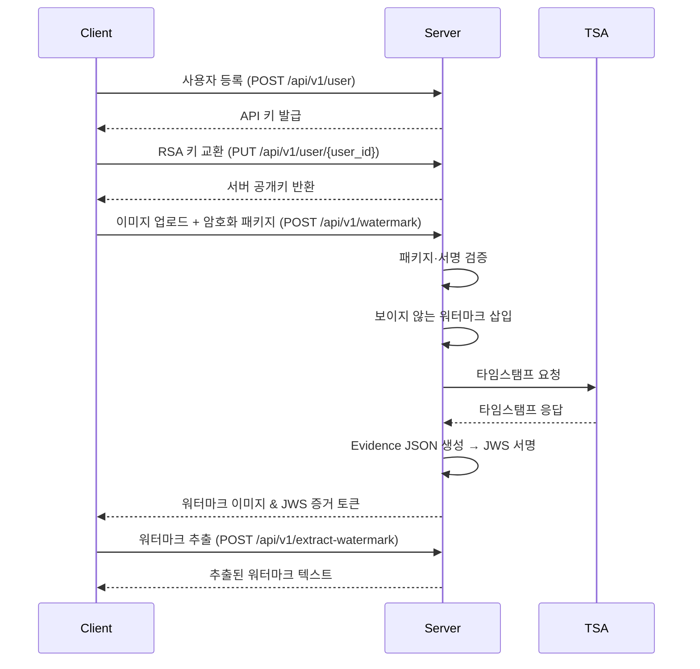

# Invisible Proof – 워터마크 증거 시스템

> **"클라이언트의 저작권을, 눈에 보이지 않게."**

Invisible Proof는 디지털 이미지에 **보이지 않는 워터마크**와 **RFC 3161 타임스탬프**를 삽입하고, 모든 증거를 **JWS 토큰** 하나로 패키징해 주는 서비스입니다. 서버가 아닌 **클라이언트**의 소유권을 대행 증명한다는 점이 기존 워터마크 솔루션과 가장 다른 점입니다.

---

## 목차
1. [왜 Invisible Proof인가?](#왜-invisible-proof인가)
2. [주요 특징](#주요-특징)
3. [작동 방식](#작동-방식)
4. [기술적 세부 사항](#기술적-세부-사항)
5. [API 엔드포인트](#api-엔드포인트)
6. [보안](#보안)
7. [서비스로 얻는 이점](#서비스로-얻는-이점)

---

## 왜 Invisible Proof인가?

### 📸 디지털 자산 소유권을 어떻게 증명할까?
- 시각적 워터마크는 쉽게 지워지거나 이미지 품질을 손상시킵니다.
- **Invisible Proof**는 `blind_watermark`(https://github.com/guofei9987/blind_watermark)기반의 **보이지 않는 워터마크**를 사용해 품질 손상 없이 소유권 정보를 각인합니다.

### ⏰ "언제"를 법적으로 증명하고 싶다
- 이미지가 언제 존재했는지 증명할 **신뢰할 만한 타임스탬프**가 필요합니다.
- FreeTSA.org를 통해 **RFC 3161 표준** 타임스탬프를 발급하여 향후 법적 효력 있는 TSA와도 100 % 호환됩니다.

### 📦 증거 데이터, 너무 많고 복잡하다
- 워터마크 정보, 타임스탬프, 메타데이터를 따로 관리하면 실수와 분실 위험이 커집니다.
- 서버가 **JWS 토큰**으로 한데 묶어 서명합니다. 서명 한 번으로 변조 여부를 즉시 확인할 수 있습니다.

---

## 주요 특징
- **클라이언트 중심 소유권 증명** – 서버는 클라이언트의 요청을 검증하고, 클라이언트 명의 워터마크를 삽입합니다.
- **RSA 키 교환 & 서명 검증** – 양측 RSA 키로 요청 무결성을 보장합니다.
- **중립적 제3자 역할** – 서버 서명과 TSA 타임스탬프로 제3자에게도 신뢰를 제공합니다.
- **Evidence = 이미지 + 타임스탬프 + 메타데이터** – 모두를 JWS 1 토큰으로 패키징.

---

## 작동 방식



---

## 기술적 세부 사항

### Evidence JSON (payload)
```json
{
  "iss": "copyright-tanminkwan.org",
  "sub": "user_id",
  "iat": 1714024800,
  "version": "1.0",
  "evidence": {
    "file_sha256": "ab34…",
    "file_size": 512034,
    "wm_algorithm": "blind_watermark-v1",
    "wm_text": "Owned by user_id …",
    "image_url": "s3://…/watermarked_x.jpg",
    "timestamp": {
      "tsq": "<Base64-DER>",
      "tsr": "<Base64-DER>",
      "tsa_chain": "<PEM bundle>",
      "gen_time": "2025-04-25T11:22:33Z"
    }
  }
}
```

### JWS Compact Serialization
```
BASE64URL(header).BASE64URL(payload).BASE64URL(signature)
```

- **Header** – alg, kid 등 메타데이터
- **Payload** – Evidence JSON
- **Signature** – 서버 RSA 개인키로 RS256 서명

---

## API 엔드포인트

| 메서드 | 경로 | 설명 |
| --- | --- | --- |
| POST | `/api/v1/user` | 사용자 등록 & API 키 발급 |
| PUT | `/api/v1/user/{user_id}` | RSA 키 교환 |
| POST | `/api/v1/watermark` | 워터마크 삽입 & 증거 생성 |
| POST | `/api/v1/extract-watermark` | 이미지에서 워터마크 추출 |

---

## 보안
- **데이터 무결성** – JWS 서명으로 변조 여부 즉시 검증
- **키 관리** – RSA 키 교환
- **검증 로직** – SHA‑256 해시, RFC 3161 타임스탬프, JWS 서명 검증

---

## 서비스로 얻는 이점
1. **확실한 소유권 증명** – 보이지 않는 워터마크 + RFC 3161 타임스탬프
2. **법적 대응력 강화** – 표준 준수 아카이브 증거
3. **증거 관리 단순화** – JWS 1‑토큰 시스템
4. **엔드‑투‑엔드 보안** – RSA 키 교환 & TLS 1.3

---

> 설치 및 실행 방법 [Link](./installation_n_run.md)

