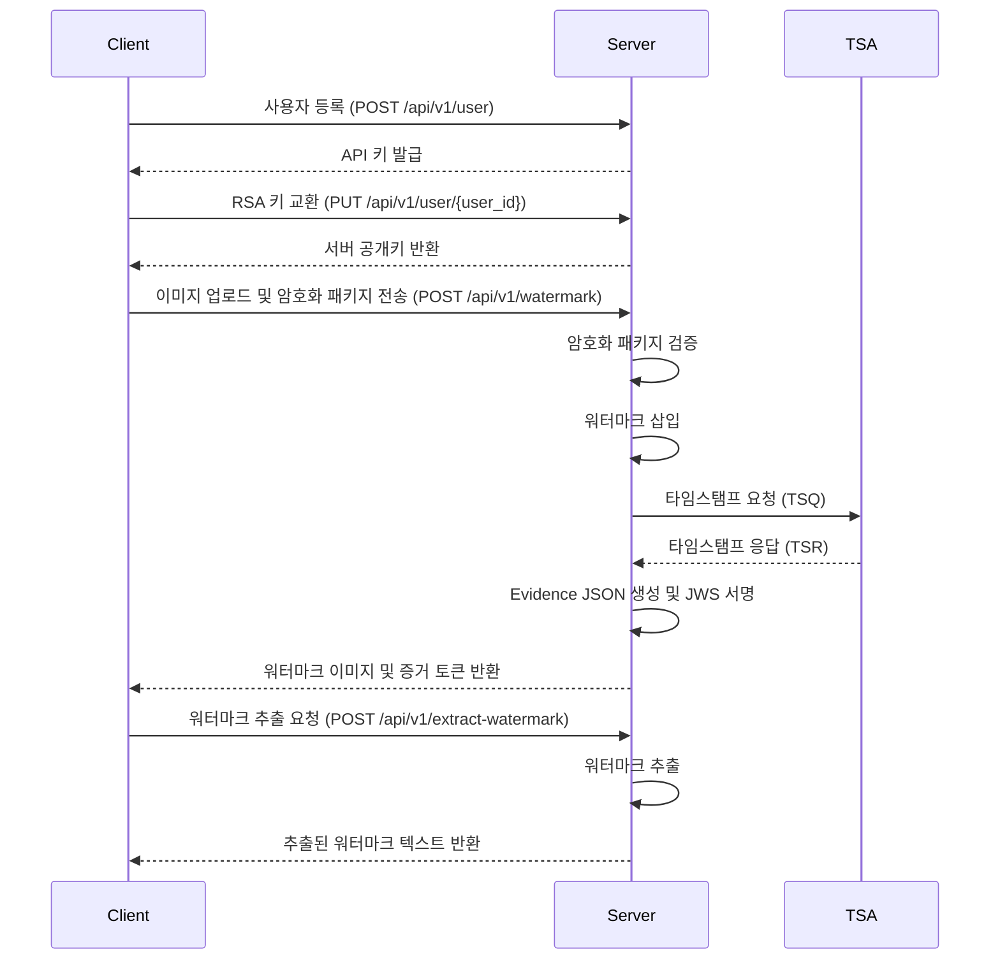

# Invisible Proof - 워터마크 증거 시스템

## 개요
**Invisible Proof**는 디지털 이미지의 저작권 보호를 위해 설계된 혁신적인 워터마크 및 타임스탬프 시스템입니다.  
이 시스템은 보이지 않는 워터마크를 삽입하고, 타임스탬프와 함께 암호화된 증거 토큰을 생성하여 이미지 소유권을 증명하고 법적 효력을 제공합니다.

---

## 서비스의 취지와 효과

### 문제점
1. **디지털 자산의 소유권 증명 어려움**  
   디지털 이미지의 소유권을 입증하기 위해서는 신뢰할 수 있는 증거가 필요합니다. 하지만 기존의 워터마크는 쉽게 제거되거나 변조될 수 있습니다.

2. **법적 시점 증명 부족**  
   이미지가 언제 생성되었는지, 소유권이 언제 등록되었는지를 입증할 수 있는 신뢰할 만한 타임스탬프가 필요합니다.

3. **복잡한 증거 데이터 관리**  
   워터마크, 타임스탬프, 메타데이터 등 여러 증거 데이터를 관리하고 공유하는 것은 번거롭고 오류가 발생하기 쉽습니다.

### 해결 방안
1. **보이지 않는 워터마크 삽입**  
   `blind_watermark` 알고리즘을 사용하여 이미지에 소유권 정보를 삽입합니다. 이 워터마크는 이미지의 시각적 품질에 영향을 주지 않으며, 변조 방지 기능을 제공합니다.

2. **RFC3161 표준 타임스탬프 발급**  
   FreeTSA.org를 통해 법적 효력을 갖춘 타임스탬프를 생성하여 이미지의 생성 시점을 증명합니다.

3. **증거 패키징 및 서명**  
   워터마크, 타임스탬프, 메타데이터를 JSON 구조로 통합하고, 서버의 RSA 개인키로 서명하여 JWS 토큰으로 제공합니다. 이를 통해 단일 토큰으로 모든 증거를 안전하게 관리하고 공유할 수 있습니다.

---

## 주요 기능

- **보이지 않는 워터마크 삽입**  
  이미지에 소유권 정보를 삽입하여 변조 방지 및 소유권 증명을 지원합니다.

- **RFC3161 타임스탬프 발급**  
  FreeTSA.org를 통해 생성된 타임스탬프는 법적 효력을 가지며, 이미지의 생성 시점을 증명합니다.

- **JWS 토큰 기반 증거 관리**  
  워터마크, 타임스탬프, 메타데이터를 JWS 토큰으로 통합하여 단일 데이터로 관리 및 검증이 가능합니다.

- **안전한 RSA 키 교환**  
  클라이언트와 서버 간 RSA 키 교환을 통해 안전한 통신과 데이터 보호를 보장합니다.

- **무결성 검증**  
  JWS 서명을 통해 데이터의 변조 여부를 검증할 수 있습니다.

---

## 작동 방식

1. **사용자 등록**  
   사용자가 등록하고 API 키를 발급받습니다.

2. **키 교환**  
   클라이언트와 서버 간 RSA 키를 교환하여 안전한 통신을 설정합니다.

3. **워터마크 삽입**  
   사용자가 이미지를 업로드하면 서버가 워터마크를 삽입하고, 타임스탬프를 생성합니다.

4. **증거 토큰 생성**  
   서버는 워터마크, 타임스탬프, 메타데이터를 JSON 구조로 통합하고, 이를 RSA 개인키로 서명하여 JWS 토큰을 생성합니다.

5. **결과 반환**  
   서버는 워터마크가 삽입된 이미지와 JWS 토큰을 클라이언트로 반환합니다.

6. **검증 및 저장**  
   클라이언트는 JWS 토큰의 서명을 검증하고, 워터마크 이미지와 증거 데이터를 저장합니다.
   
### 워크플로우 다이어그램

---

## 기술적 세부 사항

### 증거 토큰 구조
#### Evidence JSON (Payload)
```json
{
  "iss": "copyright-tanminkwan.org",
  "sub": "user_id",
  "iat": 1714024800,
  "version": "1.0",
  "evidence": {
    "file_sha256": "ab34…",
    "file_size": 512034,
    "wm_algorithm": "blind_watermark-v1",
    "wm_text": "Owned by user_id …",
    "image_url": "s3://…/watermarked_x.jpg",
    "timestamp": {
      "tsq": "<Base64-DER>",
      "tsr": "<Base64-DER>",
      "tsa_chain": "<PEM bundle>",
      "gen_time": "2025-04-25T11:22:33Z"
    }
  }
}
```

#### JWS Compact Token
```
BASE64URL(header).BASE64URL(payload).BASE64URL(signature)
```
- **Header**: 서명 알고리즘 및 키 ID에 대한 메타데이터.
- **Payload**: Evidence JSON.
- **Signature**: 서버의 개인키로 RS256 서명.

---

## API 엔드포인트

| 엔드포인트                  | 메서드 | 설명                                       |
|---------------------------|--------|-------------------------------------------|
| `/api/v1/user`            | POST   | 사용자 등록 및 API 키 생성.                |
| `/api/v1/user/{user_id}`  | PUT    | RSA 키 교환 및 사용자 자격 설정.           |
| `/api/v1/watermark`       | POST   | 워터마크 삽입 및 증거 생성.                |
| `/api/v1/extract-watermark` | POST | 이미지에서 워터마크 추출.                  |

---

## 보안 기능

- **데이터 무결성**  
  JWS 서명을 통해 데이터의 변조 여부를 검증할 수 있습니다.

- **키 관리**  
  RSA 키를 안전하게 교환 및 저장하여 데이터 보호를 강화합니다.

- **검증**  
  SHA-256 해싱, 타임스탬프 검증, JWS 서명 검증을 통해 데이터의 신뢰성을 보장합니다.

---

## 서비스의 효과

1. **소유권 증명**  
   보이지 않는 워터마크와 타임스탬프를 통해 디지털 이미지의 소유권을 명확히 증명할 수 있습니다.

2. **법적 효력 제공**  
   RFC3161 표준 타임스탬프와 JWS 서명을 통해 법적 효력을 갖춘 증거를 제공합니다.

3. **효율적인 증거 관리**  
   JWS 토큰을 통해 모든 증거 데이터를 단일 데이터로 관리하고, 손쉽게 공유할 수 있습니다.

4. **보안 강화**  
   RSA 키 교환과 TLS 1.3을 통해 데이터 전송 및 저장의 보안을 강화합니다.